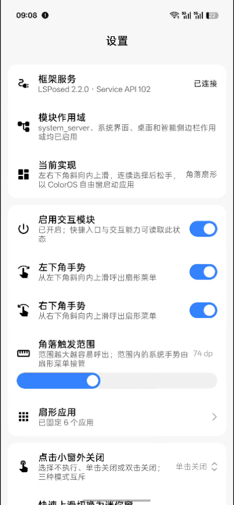

  

<h1 align="center">Flyme 小窗（FlymeFreeform）</h1>

  
  
  

魅族 Flyme 的小窗，将“呼之即来，挥之即去”做得轻巧又顺手。几次简单的滑动与轻点，便能处理眼前的小事，这份细腻的巧思让人愉悦。

本项目通过 Xposed 模块，将这份即用即走的快捷交互带到 ColorOS。

## 预览

  

## 功能

- **快速唤出**：从左右下角斜向内上滑，呼出扇形菜单，滑选应用后松手以小窗打开。
- **窗外关闭**：支持单击或双击小窗外关闭，也可关闭此功能。
- **上滑迷你窗**：快速上滑普通小窗底部横条，切换为迷你小窗。
- **应用管理**：最多固定六个应用，支持拖动排序，通过“更多”访问其他应用与系统工具。
- **应用分身**：分身与主应用分别固定，扇形中以角标区分，可直接以小窗打开分身。
- **手势设置**：左右入口独立开关，可调整角落触发范围。
- **自动暂停**：默认在横屏或游戏模式下暂停增强，退出后自动恢复，可分别关闭。

*更多功能持续开发中。*

## 设计与实现

本项目借鉴 Flyme 的快捷交互，复刻扇形菜单的展开动画与滑选体验；“更多”窗口复用 ColorOS 智能侧边栏的“全部”面板，应用窗口继续由系统已有的自由窗能力管理。

完整照搬另一套系统的界面，容易造成视觉与操作上的割裂；另建一套小窗能力，也会增加系统适配与后续维护的成本。因此，我们保留 Flyme 的交互巧思，同时沿用 ColorOS 的界面与窗口能力，让这份体验自然融入当前系统。

## 致谢

- [Flyme](https://www.flyme.com/)：感谢其小窗细腻的设计与交互巧思。
- [libxposed API](https://github.com/libxposed/api)：现代 Xposed API。
- [Miuix](https://github.com/compose-miuix-ui/miuix)：UI 组件库。

## 许可证

本项目基于 GPL-3.0 开源，详情请参阅 [LICENSE](LICENSE)。
